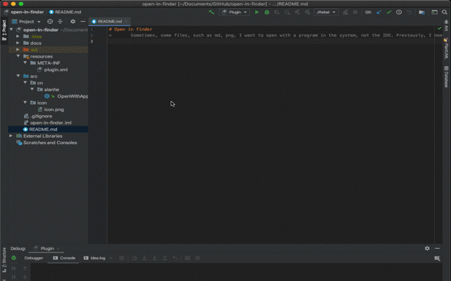

# Open With Application
> Sometimes, some files, such as md, png, I want to open with a program in the system, 
> not the IDE. Previously, I needed to open the finder where the file is, and then > double-click, 
> or right-click to select the appropriate program, 
> and now I just need to click Right-click and select Open with Application.

## Screenshot

### Install

<iframe width="245px" height="48px" src="https://plugins.jetbrains.com/embeddable/install/13813"></iframe>

<iframe width="384px" height="319px" src="https://plugins.jetbrains.com/embeddable/card/13813"></iframe>
